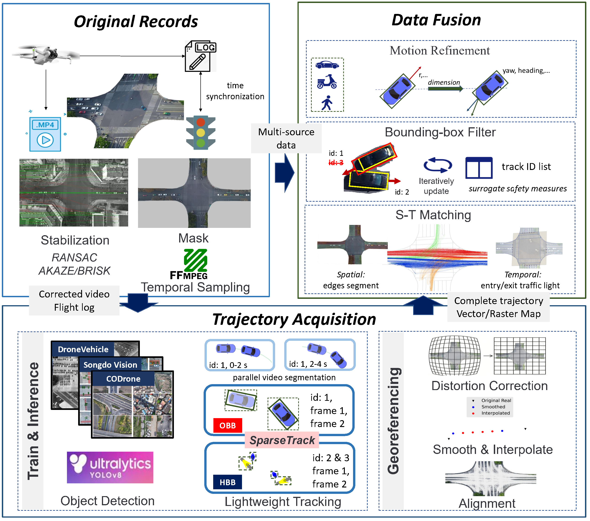

# FLUID: A Fine-Grained Lightweight Urban Signalized-Intersection Dataset of Dense Conflict Trajectories

#### Brief Introduction

This dataset and its attached pipeline are lightweight but useful.

High-quality data after processing vs. Raw data: 

https://github.com/user-attachments/assets/5523a70e-1dfe-435c-873d-4a34dee4374b

#### ToDo List

- [x] Upload data processing code

- [x] Upload [Field Descriptions](./docs/field_descriptions.md)

- [x] Upload data verification code (mainly the SSMs)

- [x] Upload a demo video

- [x] Make the Figshare dataset public (figshare: https://doi.org/10.6084/m9.figshare.29974954.v1)

- [x] Related research (In Progress)

#### Demo

The main process is data processing, and the order is based on the numbers before the file names.

#### Pipeline for A Successful Drone Experiment



#### Scenario Details


#### Demo Video (v1)

[Click here to view the Demo Video](docs/demoVideo.mp4)

## Citation

If you find this project useful or use our dataset/code in your research (Github/Figshare), please consider citing our work:

```bibtex
@article{Chen2026,
  author = {Chen, Yiyang and Wu, Zhigang and Zheng, Guohong and Wu, Xuesong and Xu, Liwen and Tang, Haoyuan and He, Zhaocheng and Zeng, Haipeng},
  title = {A Fine-Grained Lightweight Urban Signalized-Intersection Dataset of Dense Conflict Trajectories},
  journal = {Scientific Data},
  year = {2026},
  volume = {},
  number = {},
  pages = {},
  doi = {10.1038/s41597-026-07110-9},
  url = {https://doi.org/10.1038/s41597-026-07110-9},
  issn = {2052-4463},
  note = {Accepted: 2026-03-19}
}

@article{Chen2025,
author = "Yiyang Chen and Zhigang Wu and Guohong Zheng and Xuesong Wu and Liwen Xu and Haoyuan Tang and Zhaocheng He and Haipeng Zeng",
title = "{FLUID: A Fine-Grained Lightweight Urban Signalized-Intersection Dataset of Dense Conflict Trajectories}",
year = "2025",
month = "8",
url = "https://figshare.com/articles/dataset/FLUID_A_Fine-Grained_Lightweight_Urban_Signalized-Intersection_Dataset_of_Dense_Conflict_Trajectories/29974954",
doi = {10.6084/m9.figshare.29974954.v1}
}

@article{chen2025fluid,
  title = {FLUID: A Fine-Grained Lightweight Urban Signalized-Intersection Dataset of Dense Conflict Trajectories},
  author = {Chen, Yiyang and Wu, Zhigang and Zheng, Guohong and Wu, Xuesong and Xu, Liwen and Tang, Haoyuan and He, Zhaocheng and Zeng, Haipeng},
  journal = {arXiv preprint arXiv:2509.00497},
  year = {2025},
  note = {Guangdong Provincial Key Laboratory of Intelligent Transportation Systems, Sun Yat-sen University},
  url = {https://arxiv.org/abs/2509.00497}
}
```
